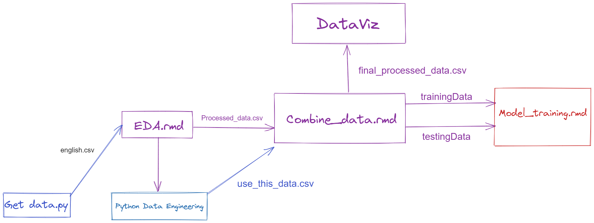

# STAT3612 Project - Predicting Premium League Winning Team

Grigoras Vlad, Parnes Jesse, Poon Sze Sen, Chan Tsz Hei

## Directory


Hello and welcome to our project's GitHub repository. 

Documents of interest are:  
```
├───archive                       # unused data/code
├───data                          # data of our project
│   └───old                       # outdated csv files
├───img                           # images of our report/appendix
│   ├───cross_validation_plots       
│   ├───feature_importance
│   ├───missing_data_profile
│   └───model_evaluation_training_set
├───outputs                       # Outputs of model summaries
│   ├───confusion_matrices
│   ├───look-foward-bias          # Outputs of model summaries
│   └───test results              # model results on test dataset
└───reports                       # EDA reports on our datasets
    ├───Data Profile Reports
    │   └───ReportDataOld_files      
    └───train_report_pngs
```

## Code files

  [DataEngg.rmd](./DataEngg.Rmd): Data Engeneering Part  
  [combine_data.rmd](./combine_data.Rmd): The Data Concatanation  
  [DataVis.rmd](./DataVis.Rmd): Data Visualization Part of the EDA  
  [EDA.rmd](./EDA.Rmd): EDA walkthrough  
  [Model_training.rmd](./Model_training.rmd): Model Training

## Data Pipeline




## Key to csv columns
Div = League Division
Date = Match Date (dd/mm/yy)
Time = Time of match kick off
HomeTeam = Home Team
AwayTeam = Away Team
FTHG and HG = Full Time Home Team Goals
FTAG and AG = Full Time Away Team Goals
FTR and Res = Full Time Result (H=Home Win, D=Draw, A=Away Win)
HTHG = Half Time Home Team Goals
HTAG = Half Time Away Team Goals
HTR = Half Time Result (H=Home Win, D=Draw, A=Away Win)

Match Statistics (where available)
Attendance = Crowd Attendance
Referee = Match Referee
HS = Home Team Shots
AS = Away Team Shots
HST = Home Team Shots on Target
AST = Away Team Shots on Target
HHW = Home Team Hit Woodwork
AHW = Away Team Hit Woodwork
HC = Home Team Corners
AC = Away Team Corners
HF = Home Team Fouls Committed
AF = Away Team Fouls Committed
HFKC = Home Team Free Kicks Conceded
AFKC = Away Team Free Kicks Conceded
HO = Home Team Offsides
AO = Away Team Offsides
HY = Home Team Yellow Cards
AY = Away Team Yellow Cards
HR = Home Team Red Cards
AR = Away Team Red Cards
HBP = Home Team Bookings Points (10 = yellow, 25 = red)
ABP = Away Team Bookings Points (10 = yellow, 25 = red)